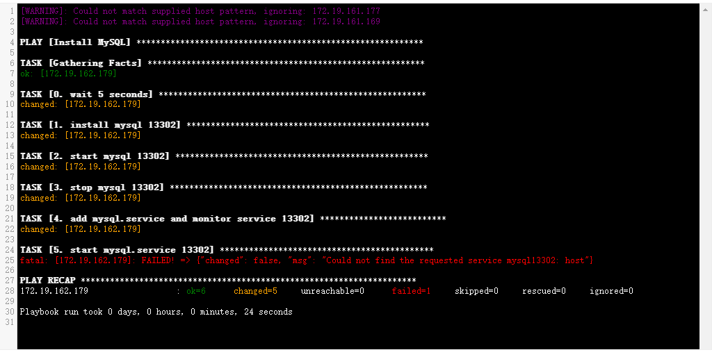

# Ansible CodeMirror

Ansible CodeMirror允许您使用CodeMirror代码编辑器来显示Ansible playbook的输出。它提供了一个用户友好的、具有语法高亮的界面，用于查看Ansible playbook，从而更轻松地分析和排除自动化任务中的问题。

## 功能特点

- **语法高亮**：Ansible CodeMirror可以高亮显示Ansible playbook的语法，提高了可读性。
- **简便集成**：可以轻松将其集成到您的Web应用程序或文档中。
- **响应式设计**：Ansible CodeMirror经过设计，可以在各种屏幕尺寸上运行良好。
- **可自定义样式**：您可以轻松自定义CodeMirror主题，以与您的应用程序设计相匹配。
- **可扩展性**：它是可扩展的，因此您可以根据需要添加额外的功能。

## 使用方法

在Vue文件中按照以下方法引用它：
```
import './ansible-playbook.css'; // 引入自定义主题 CSS 文件
import './ansible-playbook.js'; // 引入自定义 CodeMirror 模式
```

### 样式图


